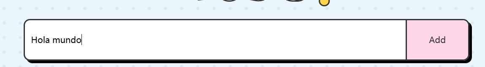
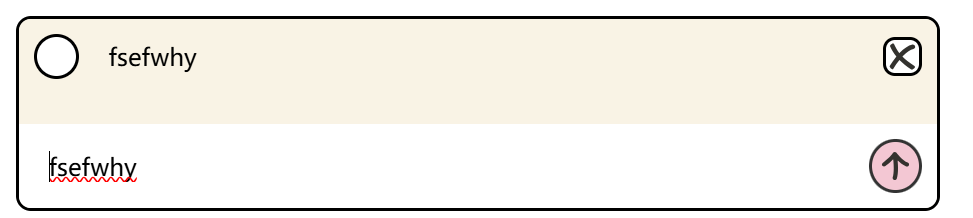
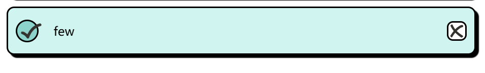
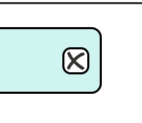
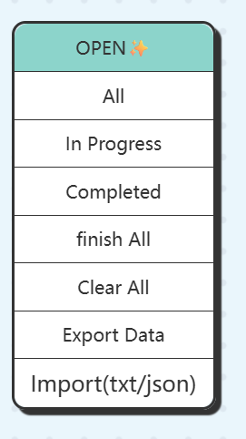

# Todo List — Fullstack (MVP)

Aplicación web para gestión de tareas desarrollada con arquitectura cliente-servidor.

Stack tecnológico:

* Frontend: HTML, CSS y JavaScript puro
* Backend: Node.js + Express
* Base de datos: PostgreSQL
* Comunicación: API REST con JSON


## Instalación

### 1. Clonar repositorio

```bash
git clone <URL_DE_TU_REPOSITORIO>
cd todo-app
```

### 2. Instalar dependencias del backend

```bash
cd backend
npm install
```

---

## Variables de entorno

Crear un archivo `.env` dentro de la carpeta `backend/` con el siguiente contenido:

```
DB_HOST=localhost
DB_USER=tu_usuario
DB_PASSWORD=tu_password
DB_NAME=tu_base_de_datos
DB_PORT=5432
PORT=4000
```

Ajustar los valores según la configuración local de PostgreSQL.

---

## Base de datos

### Crear tabla

Ejecutar el script:

```
database/schema.sql
```

### Cargar datos de ejemplo (opcional)

```
database/seed.sql
```

---

## Ejecutar el backend

Desde la carpeta backend:

```bash
npm run dev
```

Servidor disponible en:

```
http://localhost:4000
```

---

## Ejecutar el frontend

Abrir en el navegador:

```
frontend/index.html
```

El frontend consume la API en:

```
http://localhost:4000/api
```


## Funcionalidades implementadas

* Crear tareas
* Listar tareas desde la base de datos
* Marcar tareas como completadas
* Editar tareas inline (doble click)
* Eliminar tareas
* Filtro de tareas en progreso
* Contador de tareas pendientes
* Marcar todas como completadas
* Interfaz responsive
* Persistencia real en PostgreSQL

---


## Evidencia

### Crear tarea



### Editar tarea



### Completar tarea



### Eliminar tarea



### Filtrar tareas



## Arquitectura

El backend sigue una arquitectura por capas:

```
routes => controllers => repositories => database
```

Ventajas:

* Separación de responsabilidades
* Código mantenible
* Fácil escalabilidad
* Mejor testeo

---


